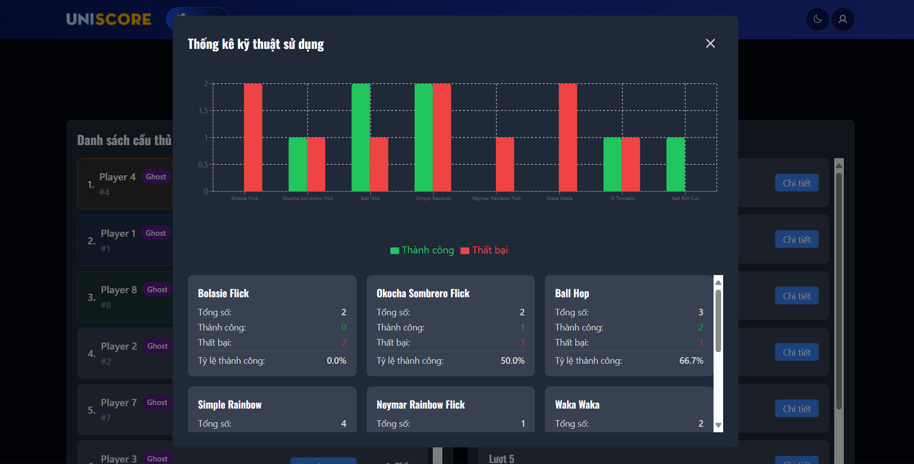

# NGUYỄN HUY KHẢI - INTERVIEW ROUND 1

## 📝 Mô tả
Dưới đây là video demo của dự án của mình và giải thích chi tiết về dự án. Mong mọi người xem qua và để ý đến những điều mình có thể làm tốt hơn.

## 🎥 Video Demo
Xem video hướng dẫn chi tiết tại đây:

## ⚙️ Cài đặt

### Yêu cầu hệ thống
- Node.js version 18.x trở lên
- npm hoặc yarn
- Các yêu cầu khác (nếu có)

### Các bước cài đặt

1. Clone repository
https://github.com/nguyenhuykhai/football.git

2. Install dependencies
npm install

3. Run the project
npm run dev

## 🛠️ Công nghệ sử dụng
- [React](https://reactjs.org/) - Frontend framework
- [Tailwind CSS](https://tailwindcss.com/) - CSS framework
- [Redux Toolkit](https://redux-toolkit.js.org/) - State management
- [React Router](https://reactrouter.com/) - Routing
- [React Hook Form](https://react-hook-form.com/) - Form validation
- [Yup](https://github.com/jquense/yup) - Schema validation
- [Vite](https://vitejs.dev/) - Build tool
- [Các công nghệ khác...]

## 📝 License
Dự án này được phân phối dưới giấy phép [MIT License](LICENSE).

## 👥 Tác giả
- **Nguyễn Huy Khải** - *Initial work* - [GitHub profile](https://github.com/nguyenhuykhai)

## 📧 Liên hệ
- Email: huykhai.work@gmail.com
- Website: https://www.huykhai.online
- LinkedIn: https://www.linkedin.com/in/khai-huy-nguyen
